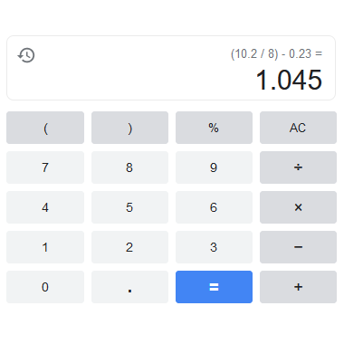
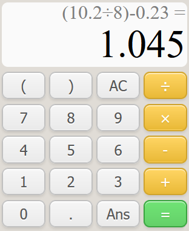

A simple, responsive, calculator with React & vanilla css.

Try the [live demo](https://pocketcalculator.netlify.app/).

A learning project to get my feet wet with React. Emulates the right portion of google's browser calculator, its previous expression indicator, and disallows invalid expression inputs.

 

Lots of things that could be improved, such as using a finite-state machine when building expressions, implementing an expression history and undo features, and polishing the overall css organization and responsiveness.

### Installation
If you want to run the app locally:

    git clone https://github.com/tiagodinis/calculator
    npm i
    npm start

### License
[MIT License](https://opensource.org/licenses/MIT).
